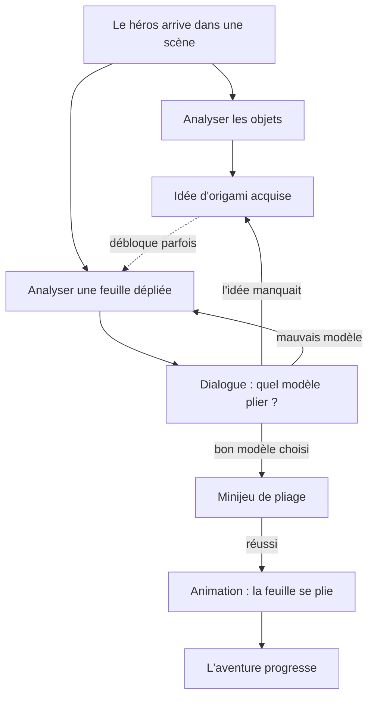

# La boucle de jeu

## Vue d'ensemble

## Les deux natures d'interactif

Une scène contient deux familles d'éléments actifs, et cette distinction
structure tout le reste.

**Les objets** sont des sources d'idées. Un oiseau sur le rebord de la fenêtre,
une gravure, une conversation : les analyser donne au joueur l'**idée** d'un
modèle d'origami. Ils ne se consomment pas et ne se ramassent pas.

**Les feuilles dépliées** sont les points d'action. Les analyser ouvre le
dialogue qui mène au pliage. Une feuille est une ressource **à usage unique** :
une fois pliée, elle devient un objet du décor.

C'est la même mécanique de hotspot dans les deux cas — seul le contenu diffère.

## Les idées sont une monnaie

Ce qu'on emporte d'une scène à l'autre, ce sont d'abord des **savoir-faire** :
l'idée d'un modèle, pas une clé ni un levier. Le chapitre 1 a montré la nuance —
le héros porte aussi une hache et du bois, et les ranger ailleurs que dans les
idées aurait doublé l'interface pour rien.

**Une seule liste, donc.** Idées et objets partagent le même inventaire, le même
tag `# give:`, la même condition `has_` ; seul l'affichage les distingue. Voir
[04-interface.md](04-interface.md).

Et une idée **se dépense** : elle quitte l'inventaire au moment où elle sert,
comme la feuille qu'elle a fait plier. Ce qui reste acquis pour de bon n'est pas
une idée mais un **drapeau** — un fait appris, qui ne prend aucune place à
l'écran. Voir [02-chapitres-et-scenes.md](02-chapitres-et-scenes.md).

## Le verrou : deux façons d'obtenir une idée

Certaines feuilles exigent d'avoir déjà l'idée. D'autres non — le dialogue la
fait naître.

| Cas | Comportement |
| --- | --- |
| Feuille **verrouillée** | Sans l'idée requise, le dialogue tourne court : le héros regarde le papier sans savoir qu'en faire. Il faut aller chercher l'idée ailleurs dans la scène ou le chapitre. |
| Feuille **libre** | Le dialogue amène l'idée de lui-même, par l'observation ou le souvenir. La feuille est à la fois l'énigme et l'indice. |

Ce mélange est délibéré. Le verrou crée le rythme d'exploration (« il me manque
quelque chose, je retourne voir »), la feuille libre évite l'impasse et relance
quand le joueur bloque. Un chapitre entièrement verrouillé devient une chasse au
trésor frustrante ; entièrement libre, il perd toute progression.

**Règle de conception** : la première feuille d'un chapitre est libre. Elle
enseigne la mécanique sans punir.

## Le dialogue de choix

Analyser une feuille ouvre un court dialogue. Il se termine par un choix : quel
modèle plier ?

Les options proposées sortent des idées que le joueur a en main — on ne peut pas
choisir un modèle qu'on ne connaît pas. C'est le dialogue qui les présente : il
n'y a pas d'écran de carnet à consulter avant
(voir [04-interface.md](04-interface.md)). Le bon choix lance le minijeu.

**Tranché : le mauvais choix est *doux*.** Le héros écarte la piste, la feuille
reste utilisable, le joueur réessaie aussitôt. Rien n'est perdu, rien n'est
puni.

C'est le comportement par défaut **et il ne demande rien à écrire** : dans ink,
un choix en `+` (et non `*`) reste reproposé tant que la feuille n'est pas
pliée. Une mauvaise piste ne ferme donc jamais l'accès au bon modèle.

Un mauvais choix peut recevoir une **réaction écrite** — un pliage raté mais
drôle, qui met sur la voie — quand une combinaison précise le mérite. C'est du
contenu au cas par cas, pas une règle : le code ne distingue pas ce cas, et
l'auteur le signalera là où il se produit.

Ce qui est écarté, c'est de **gâcher la feuille**. Dans un jeu contemplatif d'une
heure, un joueur privé de papier est un joueur qui s'arrête.

## Le minijeu

Déclenché uniquement sur le bon modèle. C'est **l'énigme de reconstitution du
crease pattern**, la même dans presque tous les cas : le motif de plis est
découpé en pièces qu'on replace sur une grille d'ancrage. Elle est décrite en
détail dans [05-puzzle-crease-pattern.md](05-puzzle-crease-pattern.md).

Trois règles tranchées :

- **On ne peut pas le rater définitivement.** Une vérification fausse fait
  clignoter le diagramme en rouge, et on réessaie immédiatement, autant de fois
  qu'on veut.
- **On peut abandonner** à tout moment et revenir à la scène. La feuille est
  toujours là, l'énigme se rouvre.
- **Pas de notion de qualité.** Un pliage est fait ou ne l'est pas : ni score,
  ni « parfait / correct / bancal », ni répercussion sur l'animation ou la
  suite.

L'énigme n'est pas une scène Phaser mais une **surface DOM plein écran**
au-dessus du canvas ([`crease-puzzle.ts`](../src/game/puzzle/crease-puzzle.ts)) —
c'est le seul glisser du jeu, et `setPointerCapture` suit le doigt même sorti du
cadre, ce que Phaser ne peut pas faire avec `input.windowEvents: false`. La
scène reste montée derrière, donc le retour est instantané.

Elle rend son verdict dans un drapeau `<nom>_resolu`, que la narration teste
pour écrire la réussite comme l'abandon.

## Le retour en scène

Le minijeu réussi rend la main à la scène, et c'est là que se place le moment
fort : **l'animation de pliage**, calculée depuis le vrai crease pattern du
modèle. La feuille se plie sous les yeux du joueur.

Ensuite la scène a changé de façon permanente : la feuille dépliée a disparu, le
modèle plié est là, et quelque chose s'ouvre — un passage, une idée, une réaction
d'un personnage.

**Ce changement doit être visible depuis la scène**, pas seulement raconté. Le
joueur qui revient dans la pièce trois chapitres plus tard doit voir ses pliages.

## État de l'implémentation

| Élément | Statut |
| --- | --- |
| Hotspot → dialogue → tag d'effet | ✅ fonctionne |
| Animation de pliage depuis un CP | ✅ fonctionne |
| Distinction objet / feuille | ⚠ pas encore implémenté |
| Carnet d'idées | ✅ c'est l'inventaire — pas de liste séparée |
| Verrou par idée requise | ⚠ mécanisme prêt (`has_`), pas encore utilisé dans le récit |
| Minijeu (énigme de crease pattern) | ✅ fonctionne |
| État persistant de scène (feuille pliée) | ⚠ partiel — le retrait d'un objet du décor fonctionne |
